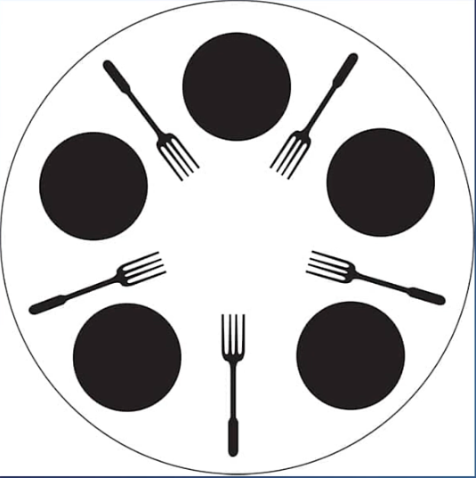

# The Dining Philosophers

A classic computer science problem introduced by Dijkstra in 1965
Five philosophers live in a house together, and they always dinetogether at the same table, sitting in the same place.
They always eat a special kind of spaghetti which requires twoforks.
There are two forks next to each plate, which means that no twoneighbours can be eating at the same time.

